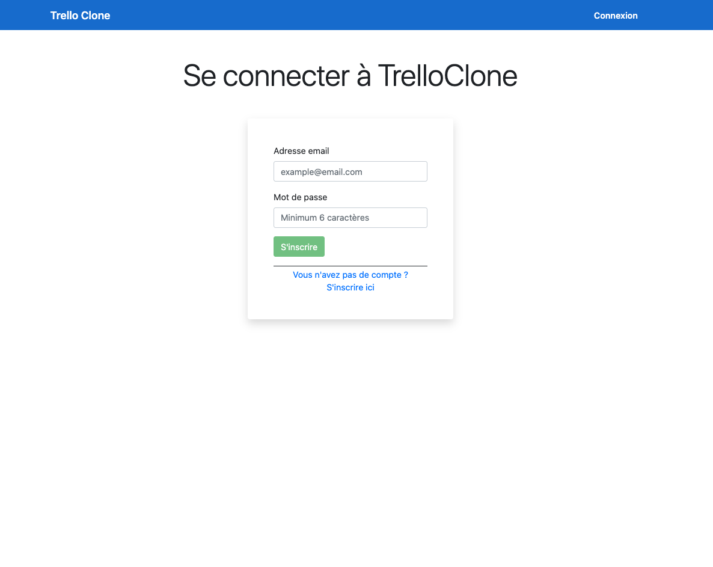
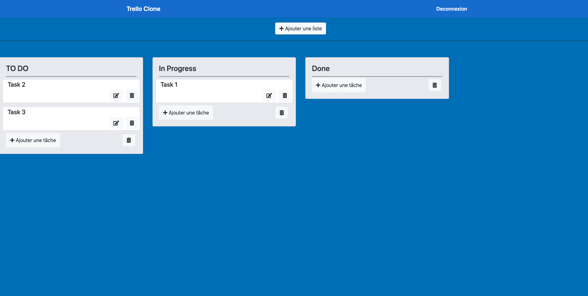

# Trello

This project was generated with [Angular CLI](https://github.com/angular/angular-cli) version 9.1.6.

## Features : 
- Authentication - Firebase
- To Do list 
- Task list
- Drag and Drop Tasks
- CRUD lists without updating lists
- CRUD Tasks

## Descriptions :

This is a clone of Trello.
This application is made with Angular for the front-end and Firebase services for authentication and database.

[Let's go](https://trello-b2971.web.app/)
